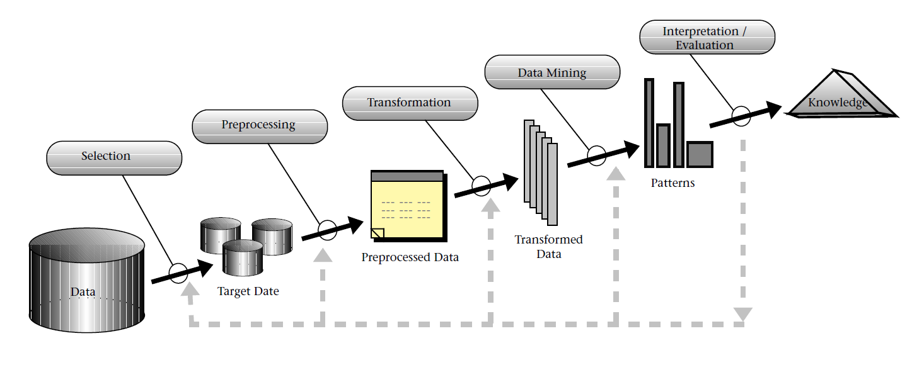

# From Data Mining to Knowledge Discovery in Databases
Usama Fayyad, Gregory Piatetsky-Shapiro, and Padhraic Smyth 
https://ojs.aaai.org//index.php/aimagazine/article/view/1230

*__1__*. First is developing an understanding of the application domain and the relevant prior knowledge and identifying the goal of the KDD process from the customer’s viewpoint.

*__2__*. Second is creating a target data set: selecting a data set, or focusing on a subset of variables or data samples, on which discovery is to be performed.

*__3__*. Third is data cleaning and preprocessing. Basic operations include removing noise if appropriate, collecting the necessary information to model or account for noise, deciding
on strategies for handling missing data fields, and accounting for time-sequence information and known changes.

*__4__*. Fourth is data reduction and projection: finding useful features to represent the data depending on the goal of the task. With dimensionality reduction or transformation methods, the effective number of variables under consideration can be reduced, or invariant representations for the data can be found.

*__5__*. Fifth is matching the goals of the KDD process (step 1) to a particular data-mining method. For example, summarization, classification, regression, clustering, and so on, are described later as well as in Fayyad, Piatetsky- Shapiro, and Smyth (1996).

*__6__*. Sixth is exploratory analysis and model and hypothesis selection: choosing the datamining algorithm(s) and selecting method(s) to be used for searching for data patterns. This process includes deciding which models and parameters might be appropriate (for example, models of categorical data are different than models of vectors over the reals) and matching a particular data-mining method with the overall criteria of the KDD process (for example, the end user might be more interested in understanding the model than its predictive capabilities).

*__7__*. Seventh is data mining: searching for patterns of interest in a particular representational form or a set of such representations, including classification rules or trees, regression, and clustering. The user can significantly aid the data-mining method by correctly performing the preceding steps.

*__8__*. Eighth is interpreting mined patterns, possibly returning to any of steps 1 through 7 for further iteration. This step can also involve visualization of the extracted patterns and models or visualization of the data given the extracted models.

*__9__*. Ninth is acting on the discovered knowledge: using the knowledge directly, incorporating the knowledge into another system for further action, or simply documenting it and reporting it to interested parties. This process also includes checking for and resolving potential conflicts with previously believed (or extracted) knowledge.

# GOTCHA! Network-based Fraud Detection for Social Security Fraud
Dr. Veronique Van Vlasselaer, Prof. Dr. Tina Eliassi-Rad, Prof. Dr. Leman Akoglu, Prof. Dr. Monique Snoeck, Prof. Dr. Bart Baesens 
https://www.semanticscholar.org/paper/GOTCHA%21-Network-Based-Fraud-Detection-for-Social-Vlasselaer-Eliassi-Rad/11517fe04965c01b34b679985bc626608224a7fd?p2df

This study aims to identify those companies that intentionally go bankrupt in order to avoid contributing their taxes using GOTCHA!.
Data set was obtained from the Belgian social security institution, which consists of Factual data, Historical data, Transactional data with times.
From Historical data and Transactional data, we can observe spider construction which is the relationships between resources and companies.
With network analysis -using GOTCHA's propagation - we can extract direct network attributes.
Finally we use intrinsic and network data as preprocessed data for learming algorithm.
Intrinsic variable include regional, sectorial, historical and legal characteristics.
Network variables include the degree, triangles and propagated exposure score, and can be classified as direct and indirect network variables depending onwhether they are 
derived from the direct nighborhood or take into account the full network.
Random Logistic Forests and Random Forest are implemented to train the models.
We can observe GOTCHA! outperform the traditional methods with AUC scores.
GOTCHA! overcomed challenges such as Umcommon, Well-considered, Time-evolving, Carefully organized, Imperceptibly concealed.
The social security institution benefits from our developed approach in multiple ways.
Guided search for fraud, Faster fraud detection, Immediate feedback loop.

# Twitter mood predicts the stock market.
Johan Bollen1;?,Huina Mao1;?,Xiao-Jun Zeng2.
https://arxiv.org/pdf/1010.3003.pdf

This paper investigate whether measurements of collective mood states derived from large-scale Twitter feeds are correlated to the value of the Dow Jones Industrial Average(DJIA) over time.
Data are tweets submitted to the Twitter service from February 28, 2008 to December 19, 2008 and Dow Jones Industrial Average closing values.
It only take into account tweets that contain explicit statements of their author's mood states.
It subject the collections of daily tweets to 2 mood assessment tools: 
1. OpinionFinder which measures positive vs. negative mood from text content 
2.GPOMS which measures 6 different mood dimensions from text content. 
It investigate the hypothesis that public mood as measured by GPOMS and OF is predictive of future DJIA values.
It use 2 analysis Granger causality analysis and Self Organizing Fuzzy Neural Network model.
Granger causality analysis is based on linear regression but SOFNN is based on non linear. 
Adding positive/negative sentiment obtained from OF has no effect on prediction accuracy compared to using only historical DJIA values.
It is found that adding Calm has highest direction accuracy.
It is found that adding Calm with happy has the lowest MAPE and good direction accuracy.
